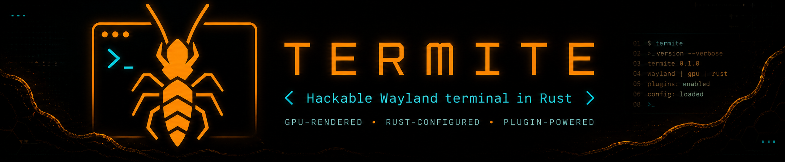

<p align="center">
  
</p>

<h1 align="center">Termite</h1>

<p align="center">
  <strong>A hackable Wayland terminal emulator in Rust.</strong>
  <br>
  GPU-rendered. Rust-configured. Plugin-powered.
</p>

<p align="center">
  <a href="./LICENSE">
    
  </a>
  
  
  
</p>

---

## What is Termite?

**Termite is a small, opinionated terminal emulator for people who want to hack the terminal itself.**

It is written in Rust, focused on Wayland, rendered with `wgpu`, configured in Rust code, and extended through in-process plugins that compile directly into the binary.

Most terminals let you configure behavior.

**Termite lets you compile behavior.**

That means your terminal config is not a TOML file pretending to be powerful. It is Rust. Your visual effects are not bolted on after the fact. They run inside the terminal frame pipeline.

Termite is not trying to be every terminal.

It is trying to be a readable, fast, deeply hackable terminal emulator for people who want to experiment with rendering, terminal state, plugins, visual effects, and compiled configuration.

---

## Why?

Because terminal emulators are usually either:

- polished daily drivers with large codebases,
- tiny experiments that do not render much,
- or configurable apps where the config eventually becomes its own weird language.

Termite explores a different shape:

> **What if a terminal was small enough to understand, GPU-rendered enough to feel modern, and Rust-native enough that config and plugins were just code?**

---

## Features

- **Wayland-first terminal emulator**
- **Rust workspace**
- **GPU rendering with `wgpu`**
- **PTY-backed shell execution**
- **Event-driven rendering loop**
- **Compiled Rust configuration**
- **In-process plugin system**
- **Theme and ANSI colour configuration**
- **Window opacity plugin**
- **Cursor line overlay plugin**
- **Animated cursor trail plugin**
- **Readable core/app split**
- **Built for hacking, not checkbox feature parity**

---

## Who this is for

You might like Termite if you want:

- a Rust terminal emulator codebase you can actually read,
- a Wayland terminal to experiment with,
- a terminal renderer built around `wgpu`,
- config as real Rust code,
- plugin behavior compiled into the app,
- a place to try visual effects, overlays, animation, and terminal UI ideas,
- or a project that is more “hackable lab” than “enterprise settings menu”.

You probably do **not** want Termite yet if you need a fully polished daily-driver replacement for Kitty, Alacritty, WezTerm, or Foot.

Termite is experimental. That is the point.

---

## Architecture

The workspace has two crates:

```text
crates/
├── c_term_core   # parser, grid, scrollback, modes, damage tracking
└── c_term_app    # PTY, windowing, rendering, config, plugins
```

### `c_term_core`

The core crate owns the terminal state:

* terminal parser,
* grid state,
* scrollback,
* terminal modes,
* damage tracking.

### `c_term_app`

The app crate owns the outside world:

* Wayland-focused windowing via `winit`,
* shell launch through `$SHELL` in a PTY,
* rendering through `wgpu`,
* compiled config,
* built-in plugins.

The app processes PTY output through `c_term_core`, tracks damage, and renders frames when something actually needs to happen.

Frames are driven by:

* PTY output,
* keyboard/mouse input,
* resize events,
* plugin animation timers,
* compositor redraw requests.

---

## Run

```bash
cargo run --release -p c_term_app
```

Exit the shell normally:

```bash
exit
```

or press:

```text
Ctrl-D
```

Emergency quit:

```text
Ctrl-Q
```

---

## Compiled config

Termite config is Rust code.

The default config lives here:

```text
crates/c_term_app/src/config.rs
```

Edit it. Rebuild. Run.

```rust
pub(crate) fn runner() -> Runner {
    Runner::new()
        .with(terminal_font())
        .with(terminal_theme())
        .with(terminal_plugins())
}

fn terminal_plugins() -> impl RunnerPart {
    parts()
        .with(screen_opacity_plugin())
        .with(cursor_line_plugin())
        .with(cursor_trail_plugin())
}
```

Config parts can be composed and nested, so local presets stay small:

```rust
fn daily_driver() -> impl RunnerPart {
    parts()
        .with(terminal_theme())
        .with(visual_plugins())
}
```

This is the central idea:

> **Your terminal config is part of your terminal.**

---

## Themes

Colours are configured before rendering, not added as a post-process tint.

A theme controls:

* default foreground,
* default background,
* 16 ANSI colours.

Example:

```rust
fn terminal_theme() -> impl RunnerPart {
    theme(Theme {
        foreground: [224, 228, 232],
        background: [10, 12, 16],
        ansi: [
            [12, 12, 12],     // black
            [230, 75, 95],    // red
            [82, 196, 120],   // green
            [229, 181, 103],  // yellow
            [91, 156, 235],   // blue
            [190, 118, 235],  // magenta
            [74, 207, 207],   // cyan
            [210, 214, 220],  // white
            [118, 124, 136],
            [255, 105, 125],
            [115, 225, 145],
            [245, 209, 125],
            [125, 180, 255],
            [215, 145, 255],
            [105, 235, 235],
            [245, 247, 250],
        ],
    })
}
```

---

## Plugins

Plugins are Rust types that implement `Plugin`.

They receive a `PluginFrame` with access to:

* the current terminal grid,
* time,
* theme data,
* overlay commands,
* window opacity.

Built-in plugins:

| Plugin          | What it does                                                                 |
| --------------- | ---------------------------------------------------------------------------- |
| `ScreenOpacity` | Makes the compositor-visible Wayland window translucent                      |
| `CursorLine`    | Minimal example plugin that emits row/cell overlays                          |
| `CursorTrail`   | Animated cursor trail plugin inspired by Kitty’s GPLv3 cursor trail behavior |

The workflow is intentionally simple:

```text
add plugin module
→ add it to terminal_plugins()
→ rebuild
→ run
```

No plugin marketplace.
No mystery runtime.
No config language pretending to be a programming language.

Just Rust.

---

## Example plugin shape

```rust
fn terminal_plugins() -> impl RunnerPart {
    parts()
        .with(screen_opacity_plugin())
        .with(cursor_line_plugin())
        .with(cursor_trail_plugin())
}
```

Termite’s plugin model is aimed at visual and terminal-behavior experiments like:

* cursor effects,
* row highlights,
* overlays,
* opacity,
* animation,
* diagnostic rendering,
* theme-aware effects,
* terminal UI experiments.

---

## Project status

Termite is experimental.

It is already useful as a terminal/rendering/codebase experiment, but it is not trying to chase full terminal feature parity yet.

Current deliberate limitations:

* text rendering is still simple,
* the default path uses an 8x16 bitmap-style cell renderer,
* optional TTF glyph rasterization exists,
* features are added only when they fit the project’s shape.

The goal is not to become a giant terminal emulator overnight.

The goal is to stay small enough to hack on.

---

## Roadmap ideas

Things that fit the project:

* better font shaping,
* richer plugin examples,
* config presets,
* GPU overlay effects,
* diagnostics/debug overlays,
* terminal recording/demo tools,
* screenshot/GIF capture for plugin demos,
* more theme packs,
* plugin cookbook,
* improved docs for terminal internals.

Things that do **not** fit unless they stay simple:

* huge settings UIs,
* endless compatibility checklists,
* config DSLs,
* turning the codebase into a maze.

---

## Name

Termite lives in the terminal.

It eats through assumptions.

It leaves trails.

It probably should not be in your walls.

---

## License

GPL-3.0-only.

See [`LICENSE`](./LICENSE).

````

For GitHub search/discovery, he should also set the repo metadata because it currently has **no description, website, or topics**. :contentReference[oaicite:1]{index=1}

**Repo description:**

```text
Hackable Wayland terminal emulator in Rust with GPU rendering, compiled config, and in-process visual plugins.
````

**Topics:**

```text
rust
terminal
terminal-emulator
wayland
wgpu
pty
plugins
rust-config
gpu-rendering
terminal-ui
```
